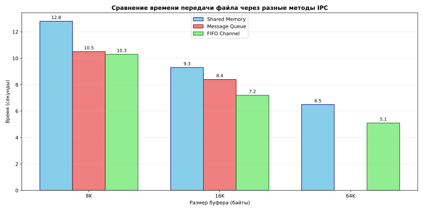

# Сравнительный анализ методов межпроцессного взаимодействия

## Описание исследования

Данное исследование направлено на сравнение эффективности трех различных методов межпроцессного взаимодействия (IPC) в операционных системах Unix/Linux. Были протестированы следующие технологии:

- **Shared Memory** (Разделяемая память)
- **Message Queue** (Очереди сообщений)
- **FIFO Channel** (Именованные каналы)

Цель исследования — определить зависимость времени передачи данных от размера буфера для каждого метода.

## Методология

### Запуск программы

Для запуска отдельного файла обратитесь к Makefile (При работе с отдельными файлами указывайте только имена файлов без расширений):

```
make
# или
make --help
```

### Тестовые параметры

- **Размеры буфера**: 8KB, 16KB, 64KB
- **Тип данных**: передача файла размером 4Гб между процессами
- **Измеряемый параметр**: время передачи в секундах
- **Условия**: одинаковые аппаратные ресурсы и нагрузка системы

### Используемые технологии

#### Shared Memory

- Прямой доступ к общей области памяти
- Наивысшая производительность среди тестируемых методов
- Требует синхронизации доступа

#### Message Queue

- Структурированная передача сообщений
- Встроенная синхронизация
- Ограничения на размер сообщений

#### FIFO Channel

- Именованные каналы (pipe)
- Файловый интерфейс доступа
- Простота реализации

> [!ATTENTION]
> Для получения наиболее репрезентабельных результатов времени передачи данных из большого файла при многократных запусках программы было принято решение постараться минимизировать влияние кэширования при работе с этим файлом, что заставило добавить флаг _O_DIRECT_ при открытии передаваемого файла.

## Результаты измерений

| Метод IPC     | 8KB буфер | 16KB буфер | 64KB буфер |
| ------------- | --------- | ---------- | ---------- |
| Shared Memory | 12.8 с    | 9.3 с      | 6.5 с      |
| Message Queue | 10.5 с    | 8.4 с      | Нет данных |
| FIFO Channel  | 10.3 с    | 7.2 с      | 5.1 с      |

## Визуализация результатов

<div align="center">
	
</div>

## Заключение

Исследование подтвердило, что выбор метода IPC и размера буфера существенно влияет на производительность межпроцессного взаимодействия. **FIFO Channel** показал неожиданно хорошие результаты при больших размерах буфера. Попытка многократного изменения размера очереди сообщений или размера одного сообщения привела к ухудшению работы программы настолько, что сделало невозможным замерить время передачи данных между процессами. Поэтому наблюдаем отсутствие данных в **Message Queue** на 64KB буфере. Это может объясняться техническими особенностями аппаратуры, на которой проводилось данное исследование.
