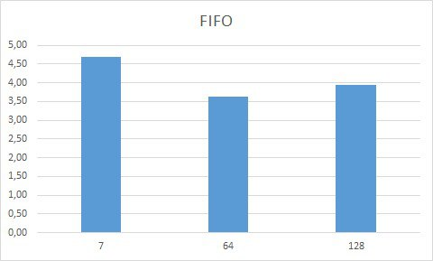
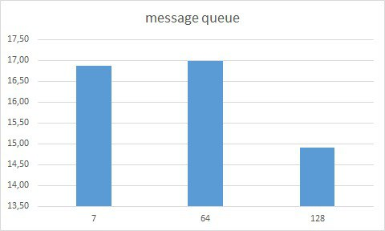
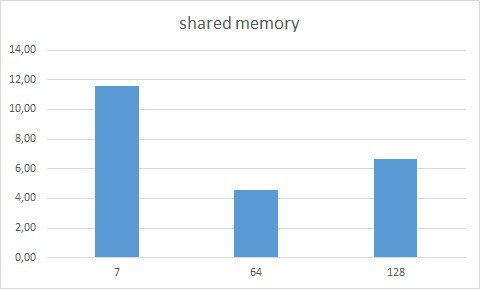

## Анализ работы нескольких способ взаимодействия процессов для передачи большого файла для буфферов разного размера

### Запуск

три папке для трех программ, в каждой папке по мэйкфайлу.
Чтобв попасть в нужную папку, используем команды
```
cd fifo
cd msg
cd shm
```
По команде 
```
make run
```
будут скомпилированы исполняемые файла программы-отправителя и -получателя. Затем создастся файла в 4 Гб под названием input_file.txt с рандомизированным содержимым. Этот файл обработается программой, результат записан в файл output.txt. Затем проверяются md5 суммы, выводятся они и сообщение-результат.
По команде
```
make clean
```
все созданные файлы будут удалены.

Размер буффера задается вручную в соответствующих файлах common.h.

### Анализ данных

По команде 
```
ipcs -l
```
узнаем максимальный размер сообщения для очереди сообщений - 8 Кб, возьмем 7 Кб. Размер буффера FIFO около 64 Кб, столько и возьмем. Третий размер возьмем в 2 раза больше - 128 Кб.

Для каждого способа взаимодействия было получено по три результата - времени работы программы. Значения усреднены и по ним построены гистограммы. Исходные данные в файле data/data.xlsx.

Полученные гистограммы:

  



