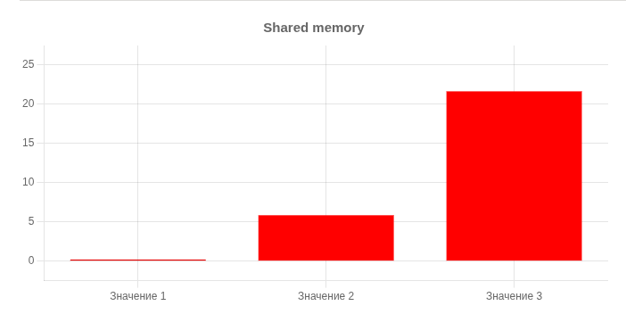
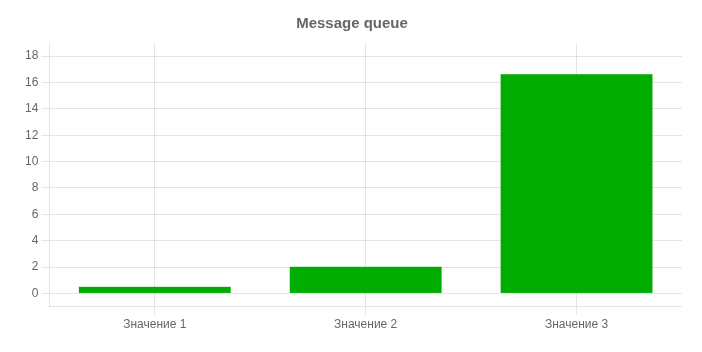

### Полученные результаты

| SIZE | SHM  | MQ | FIFO |
| ---- | ---- | -- | ---- |
| Small  | 0.19 | 0.5 | 0.02 |
| Medium  | 5.84 | 2.02 | 0.44 |
| Big  | 21.65 | 16.63 | 5.43 |

### Выводы

Как мы можем заметить, с увеличением размера файла наиболее эффективной оказывается разделяемая память (большой файл передается в 4 раза медленее среднего, тогда как для очередей сообщений: в 8 раз медленнее, для именованных каналов: в 12 раз медленее). Однако для маленьких файлов разделяемая память крайне неэффективна из-за накладных расходов на синхронизацию и создание/удаление сегментов (средний файл передается в 30! раз медленее маленького). Для передачи маленьких файлов лучше всего подходят очереди сообщений (средний файл передается всего в 4 раза медленеее маленького).