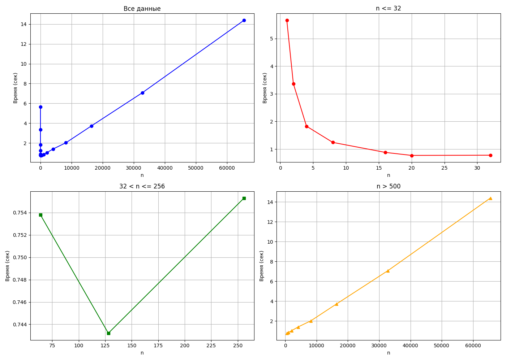
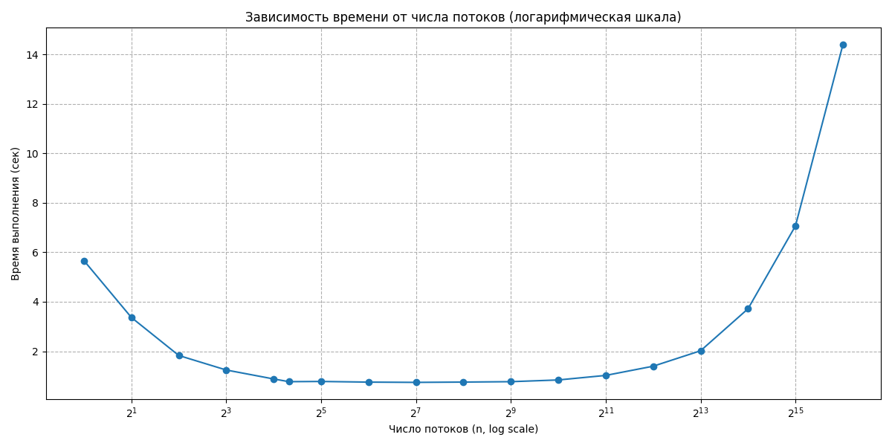

# Метод Монте-Карло: Параллельное интегрирование с измерением производительности
## Описание задачи

Реализована параллельная версия метода Монте-Карло для вычисления определённого интеграла функции:

$$
f(x) = \arctan(434x + \cosh(x)) \cdot \sin(x)
$$

с использованием **многопоточности** (`pthread`) и **разделяемой памяти** (System V `shm`).

Исследуется влияние **количества потоков** на **время выполнения** и **производительность** алгоритма.

---

## Структура проекта

- `Monte_Carlo_integration.c` — основная программа.
- `generate_and_count_points.c` — функции генерации точек и подсчёта попаданий под кривую.
- `Makefile` — для запуска с разным количеством потоков.
- `results.csv` — результаты замеров времени выполнения.
- `make_log_graph.py` — скрипт для построения графиков.

---

## Запуск

### Компиляция

```bash
mkdir build && cd build
cmake ..
make
```

### Запуск с разным количеством потоков

```bash
make run_tests
```

Программа запускается с параметрами:

```bash
./Monte_Carlo_integration n_threads n_points a b m M
```

Пример:

```bash
./Monte_Carlo_integration 4 100000000 3 7 -1.6 1.5
```

---

## Результаты

После выполнения экспериментов данные о времени выполнения сохраняются в файл `results.csv` в формате:

```
n_threads, time_taken
```

Затем с помощью скриптов **make_sub_graph.py** и **make_log_graph.py** строятся график зависимости времени от числа потоков.

### Графики 

График показывает три фазы: 

    Гипербола — при малом числе потоков (1–16) наблюдается ускорение.
    Горизонтальная прямая (в среднем, фактически ломаная переменной монотонности из-за случайных погрешностей) — при среднем числе потоков (16–128) ускорение стабилизируется.
    Наклонная прямая вверх — при большом числе потоков (>1000) время возрастает из-за накладных расходов на синхронизацию и планирование.



